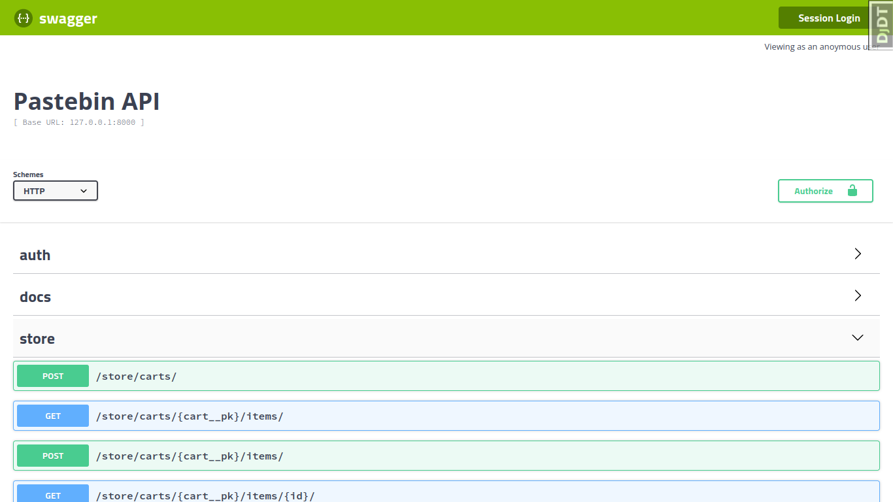

# Sibz Project

An E-commerce store RSETful API project implemented in Django Rest Framework.  

## Installation

### Step 1: Clone the repository

    git clone https://github.com/siavash71070/storefront.git

### Step 2: Create and activate a virtual environment

    virtualenv venv
    source venv/bin/activate

### Step 3: Install project requirements

    cd storefront/
    pip install -r requirements.txt

### Step 4: Run development server

    cd src
    python manage.py runserver

**You can create a super user with following command:**

    python manage.py createsuperuser

**And reach Swagger-UI at:**
http://127.0.0.1:8000/docs/